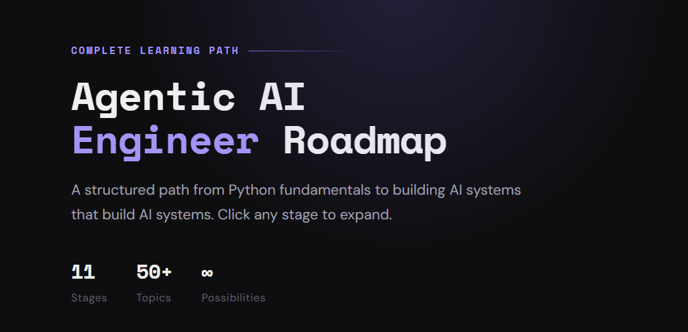

# Agentic AI Engineer Roadmap

**A structured, interactive learning path from Python fundamentals to building AI systems that build AI systems.**

 

## Overview

This roadmap covers 11 stages of the Agentic AI Engineer journey — from Python basics and LLM fundamentals to multi-agent systems, agent protocols (MCP, A2A, AG-UI), RAG pipelines, and context engineering.

Each stage is interactive — click to expand, read, and copy the full roadmap as Markdown.

## Stages

| # | Stage |
|---|-------|
| 01 | Python Fundamentals |
| 02 | LLM Fundamentals |
| 03 | Learn a Framework (LangChain / OpenAI Agents SDK / Google ADK) |
| 04 | Advanced Framework Concepts |
| 05 | Memory Management |
| 06 | Tool Integration |
| 07 | Agent Protocols & Interoperability (MCP · A2A · AG-UI) |
| 08 | RAG Systems |
| 09 | Agents & Multi-Agents |
| 10 | Build Real-World Projects (FastAPI · Chainlit · chatkit · AG-UI · Docker · Databases) |
| 11 | AI-Assisted Engineering & Context Engineering |

## Tech

Built with vanilla HTML, CSS, and JavaScript. No frameworks. No dependencies.

## License

**If this helped you, consider giving it a ⭐ — it means a lot!**

Made by [@devhammad0](https://github.com/devhammad0)

